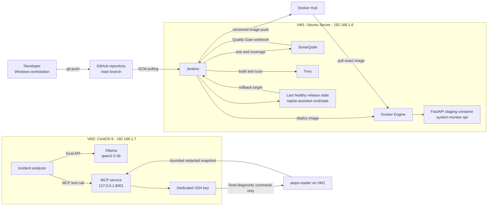
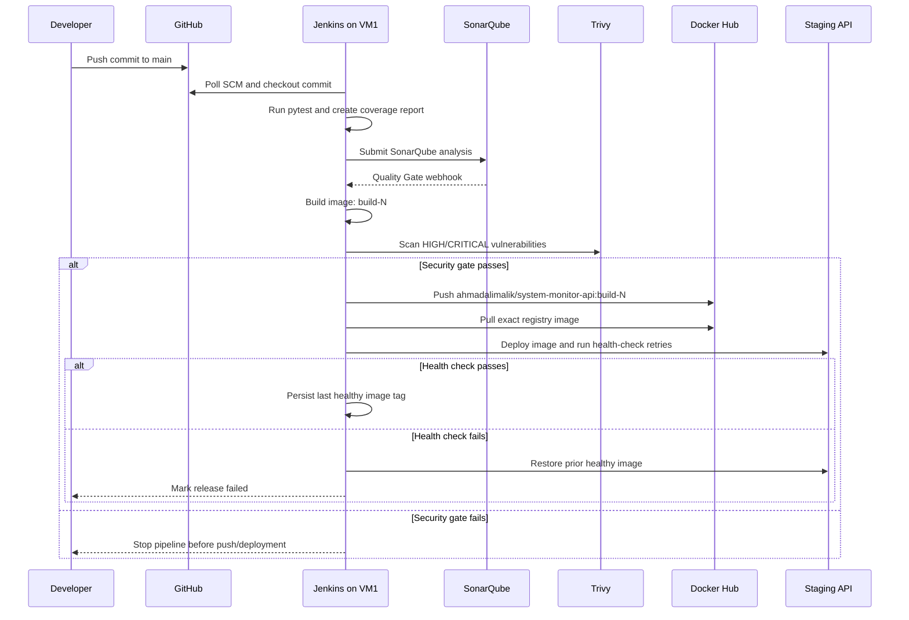
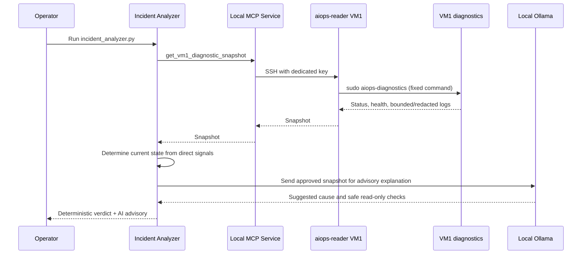

# System Design: AI-Assisted CI/CD Pipeline

## 1. Design objective

Deliver a FastAPI service through a secure, repeatable CI/CD process while providing local AI-assisted incident analysis with strict least-privilege access.

The system must:

- block releases that fail tests, code-quality checks, or image-security checks;
- deploy an immutable container image to staging;
- verify runtime health and roll back failed releases;
- let AI inspect a bounded diagnostic snapshot, not execute arbitrary infrastructure commands;
- preserve the distinction between deterministic monitoring results and advisory AI output.

## 2. High-level architecture



## 3. Network design

| Component | Network role | Access rule |
| --- | --- | --- |
| VM1 NAT adapter | Outbound internet access | Used for GitHub, Docker Hub, package updates |
| VM1 host-only adapter | Private lab interface | `192.168.1.6` |
| VM2 NAT adapter | Outbound internet access | Used for Ollama/model/package downloads |
| VM2 host-only adapter | Private lab interface | `192.168.1.7` |
| Jenkins | VM1 host-only interface | Browser access from Windows lab host |
| SonarQube | VM1 host-only interface | Browser access from Windows lab host |
| FastAPI staging service | VM1 port `8000` | Browser/API access from lab host |
| Ollama | `127.0.0.1:11434` only | Never exposed to VM1, Windows, or internet |
| MCP | `127.0.0.1:8001` only | Called only by the VM2 analyzer |

## 4. CI/CD release flow



## 5. Deployment state machine

```text
New commit
  -> TESTING
  -> QUALITY_CHECKED
  -> IMAGE_BUILT
  -> SECURITY_SCANNED
  -> PUBLISHED
  -> DEPLOYING
  -> HEALTHY -----------------> save as last successful release
       ^
       |
ROLLBACK_SUCCESSFUL <--- DEPLOYMENT_UNHEALTHY
       |
       +------------------------ release remains FAILED in Jenkins
```

## 6. AI operations flow



## 7. Trust boundaries and security controls

| Boundary | Risk | Control |
| --- | --- | --- |
| Developer to GitHub | Accidental secret commit | `.gitignore`, credential review, no `.env` or private keys in Git |
| Jenkins to Docker Hub | Registry credential exposure | Jenkins credential store and `--password-stdin` |
| Jenkins to staging Docker | Concurrent/unsafe deployments | `disableConcurrentBuilds`, versioned tags, health verification |
| SonarQube container to Jenkins | Quality Gate cannot notify Jenkins | Docker host-gateway mapping and restricted firewall access |
| VM2 AI to VM1 | AI could change infrastructure | `aiops-reader` has no Docker group and no general sudo |
| SSH diagnostics | Arbitrary command execution | One root-owned, argument-free command in sudoers |
| Diagnostic logs | Tokens/passwords in AI prompt | Bounded collection and redaction before transmission |
| AI advisory | Hallucinated or historical diagnosis | Deterministic health verdict remains authoritative |
| CentOS system service | SELinux bypass | Runtime in `/opt/aiops`, secrets in `/etc/aiops`, SELinux enforcing |

## 8. Component responsibilities

| Component | Responsibility | Does not do |
| --- | --- | --- |
| GitHub | Source-control system of record | Does not deploy directly |
| Jenkins | Orchestrates CI/CD and enforces gates | Does not use hard-coded secrets |
| SonarQube | Code analysis and Quality Gate | Does not deploy images |
| Trivy | Blocks known fixable HIGH/CRITICAL image vulnerabilities | Does not automatically remediate CVEs |
| Docker Hub | Stores versioned release images | Does not decide deployment health |
| Deploy script | Pulls, deploys, validates, and rolls back | Does not mark a bad release successful |
| FastAPI service | Provides API and `/health` signal | Does not manage infrastructure |
| MCP service | Exposes one approved diagnostic tool | Does not expose arbitrary SSH execution |
| Ollama | Produces local advisory analysis | Does not make infrastructure changes |

## 9. Failure handling

| Failure point | Expected action |
| --- | --- |
| pytest fails | Pipeline stops; no image build |
| SonarQube Quality Gate fails | Pipeline stops; no image build |
| SonarQube webhook fails | Jenkins Quality Gate times out; inspect container-to-host routing and firewall |
| Trivy finds fixable HIGH/CRITICAL CVE | Pipeline stops before image push; update dependency/base OS package and rebuild |
| Docker Hub push fails | Pipeline fails; existing staging release remains untouched |
| New container fails health check | Deploy script rolls back to last successful image and pipeline remains failed |
| VM1 service becomes unhealthy | VM2 deterministic detector returns `ACTIVE INCIDENT` |
| AI reports a weak/historical hypothesis | Treat as advisory; validate with current health signals and logs |

## 10. Design decisions

1. **Jenkins instead of GitHub Actions**: Jenkins is hosted on VM1 and provides hands-on pipeline, credential, plugin, agent, and deployment experience.
2. **Docker Hub registry**: separates build from deployment; staging pulls the actual published artifact.
3. **Local SonarQube**: supports learning internal quality-gate webhooks without requiring a public cloud service.
4. **Two VMs**: separates delivery infrastructure from AI operations and creates a realistic trust boundary.
5. **Local Ollama**: keeps log analysis in the lab instead of sending diagnostics to a cloud AI service.
6. **MCP with one tool**: demonstrates secure AI tool integration without unrestricted remote execution.
7. **Deterministic verdict first**: prevents a local LLM from turning old log messages into a false active incident.
8. **Rollback is part of deployment**: a deployment is only successful after the new service is healthy.

## 11. Portfolio evidence to capture

Use these screenshots in GitHub documentation and LinkedIn:

1. Jenkins pipeline graph with all stages green.
2. Jenkins Console Output showing `Staging deployment successful` and `Finished: SUCCESS`.
3. SonarQube dashboard showing the Quality Gate.
4. Trivy clean scan output after the Debian security update.
5. FastAPI Swagger UI at `/docs` and `/health` response.
6. VM2 output showing `MCP tool call: SUCCESS`.
7. VM2 analyzer output showing `NO ACTIVE INCIDENT` after recovery.
8. Optional controlled-incident output showing `ACTIVE INCIDENT` before recovery.

Never include screenshots containing passwords, access tokens, SSH private keys, `.env` values, Jenkins credential configuration, or server public IPs.
